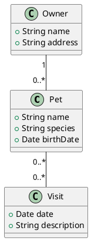

<!---
{
  "id": "25eed4ab-4d42-4ce3-866d-dc2992f713a9",
  "depends_on": [
    "AND",
    "04c71741-b965-41c0-936d-62f513e73df6s",
    "66726805-4497-4dce-a1ba-ccf930a721f8"
  ],
  "author": "Stephan Bökelmann",
  "first_used": "2025-06-06",
  "keywords": ["PlantUML", "documentation", "workflow", "LaTeX", "latexmk", "SVG", "integration"]
}
--->

# A Documentation Workflow: Integrating PlantUML with LaTeX

> In this exercise you will learn how to create diagrams from natural language requirements, transcribe them into PlantUML, generate vector graphics, and integrate them into a structured LaTeX project using automated build tools. Furthermore we will explore how to structure documentation projects for scalability and reproducibility.

In real-world technical documentation, diagrams often originate from design discussions, specifications, or plain text descriptions. Automating the generation of diagrams and their inclusion into documentation ensures consistency and reproducibility, especially in long-lived projects. This exercise will guide you through a complete mini-workflow that converts a short text specification into a class diagram, embeds it into a LaTeX document using modern best practices, and builds the full documentation using `latexmk`.

Your final output will be a structured directory containing LaTeX sources, diagrams, bibliographies, and a reproducible build pipeline.

### Further Readings and Other Sources

* [PlantUML Documentation](https://plantuml.com/)
* [KOMA-Script scrartcl documentation (CTAN)](https://ctan.org/pkg/koma-script)
* [latexmk documentation](https://mg.readthedocs.io/latexmk.html)
* [LaTeX graphics inclusion (Overleaf guide)](https://www.overleaf.com/learn/latex/Inserting_Images)
* [DOI:10.1007/978-1-4842-5617-2\_10](https://doi.org/10.1007/978-1-4842-5617-2_10)

---

## Tasks

### Task 0 — Create a Structured Project Directory

In your working directory, create the following structure:

```bash
mkdir -p documentation/{src,figures,bibliographies,build}
cd documentation
```

You will place:

* LaTeX source files in `src/`
* PlantUML diagrams in `figures/`
* Bibliographies (if any) in `bibliographies/`
* Build artifacts will be placed into `build/`

### Task 1 — Analyze the Specification

Given the following text:

> *In the PetStore system, there are Pets, Owners, and Visits. Each Pet has a name, species, and birth date. An Owner has a name, address, and a list of Pets. Visits are linked to Pets and store the date and description of the visit.*

Your task: extract relevant classes, attributes, and relationships to build a class diagram.

### Task 2 — Write the PlantUML Diagram

Create `figures/petstore-classdiagram.puml`:



### Task 3 — Generate the Diagram as PDF or EPS for LaTeX

Inside `documentation/` run:

```bash
plantuml -teps figures/petstore-classdiagram.puml
```

You will now have: `figures/petstore-classdiagram.eps`.
(EPS is chosen because it integrates perfectly into PDF/LaTeX pipelines.)

Alternatively, you may generate PDF directly:

```bash
plantuml -tpdf figures/petstore-classdiagram.puml
```

### Task 4 — Create the LaTeX Document

Inside `src/`, create `main.tex`:

```latex
\documentclass[12pt]{scrartcl}
\usepackage{graphicx}
\usepackage{caption}
\usepackage{hyperref}

\title{PetStore System Documentation}
\author{Technical Documentation Workflow}
\date{\today}

\begin{document}

\maketitle

\section{Class Diagram}

The PetStore domain model is shown in Figure~\ref{fig:classdiagram}.

\begin{figure}[ht]
    \centering
    \includegraphics[width=0.8\textwidth]{../figures/petstore-classdiagram.pdf}
    \caption{Class diagram for PetStore system}
    \label{fig:classdiagram}
\end{figure}

\section{Conclusion}

This document demonstrates integrating automatically generated diagrams into LaTeX.

\end{document}
```

> ⚠ Adjust `petstore-classdiagram.pdf` or `.eps` depending on your generated format.

### Task 5 — Automate Diagram Rendering in latexmk

Inside `documentation/`, create a build file `latexmkrc` with automatic PlantUML integration:

```perl
$pdf_mode = 1;
$aux_dir  = 'build';
$out_dir  = 'build';
$bibtex_use = 1;

# Automatically generate PDF diagrams from PlantUML files
add_cus_dep('puml', 'pdf', 0, 'plantuml2pdf');

sub plantuml2pdf {
    my ($base) = @_;
    system("plantuml -tpdf figures/$base.puml");
}
```

Now you can simply run:

```bash
cd documentation/src
latexmk -r ../latexmkrc -pdf main.tex
```

latexmk will automatically detect changes in `.puml` files, regenerate the diagrams, and compile the LaTeX document.

---

## Questions

1. Why is it helpful to separate the directory structure into `src/`, `figures/`, `bibliographies/`, and `build/`?
2. What are the advantages of using latexmk compared to plain `pdflatex`?
3. Modify the specification by adding a new class: `Vet` (name, phone). Update your PlantUML diagram accordingly.
4. Regenerate the PlantUML diagram and rebuild the LaTeX document. Confirm that the updated diagram appears in your PDF.
5. How could this workflow be integrated into a version-controlled project (e.g. git)?
6. How would you extend this workflow to generate multiple diagrams automatically?
7. What are the pros and cons of rendering diagrams on-the-fly versus committing generated diagram images into your repository?

---

## Advice

In real projects, maintaining a reproducible documentation build system pays off long-term. By combining text-based diagrams with automated compilation, you ensure documentation is always synchronized with design updates. Tools like PlantUML and latexmk allow for deterministic builds, while keeping full control locally. For larger projects, consider integrating CI pipelines that validate diagram generation and documentation compilation automatically.
